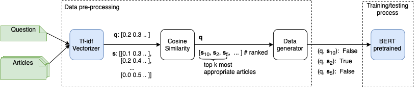

# legal-text-retrieval
## Overview 
This system contains 2 steps: 
- generate training data containing negative sample found by mixture score of cosine(tfidf) + bm25 (using top 150 law articles most similarity)
- fine-tune PhoBERT model  (+NlpHUST model - optional) on generated data 


## Environments
```bash 
git clone https://github.com/vncorenlp/VnCoreNLP.git vncorenlp_data # for vncorebnlp tokenize lib

conda create -n legal_retrieval_env python=3.8
conda activate legal_retrieval_env
pip install -r requirements.txt
```
## Run 
1. Generate data from folder `data/zac2021-ltr-data/` containing `public_test_question.json` and `train_question_answer.json`


    ```bash
    python3 src/data_generator.py --path_folder_base data/zac2021-ltr-data/ --test_file public_test_question.json --topk 150  --tok --path_output_dir data/zalo-tfidfbm25150-full
    ```
    >Note: 
    >   - `--test_file public_test_question.json` is optional, if this parameter is not used, test set will be random 33% in file `train_question_answer.json`
    >   - `--path_output_dir` is the folder save 3 output file (`train.csv`, `dev.csv`, `test.csv`) and tfidf classifier (`tfidf_classifier.pkl`) for top k best relevant documents.

2. Train model 
   ```bash
   bash scripts/run_finetune_bert.sh "magic"  vinai/phobert-base  ../  data/zalo-tfidfbm25150-full Tfbm150E5-full 5
   ``` 
    

3. Predict
   ```bash
   python3 src/infer.py 
   ```
    >Note: 
    >   This script will load model and run prediction, pls check the variable `model_configs` in file `src/infer.py` to modify. 
    
##  License
MIT-licensed. 

## Citation

Please cite as:

``` bibtex
@article{DBLP:journals/corr/abs-2106-13405,
  author    = {Ha{-}Thanh Nguyen and
               Phuong Minh Nguyen and
               Thi{-}Hai{-}Yen Vuong and
               Quan Minh Bui and
               Chau Minh Nguyen and
               Tran Binh Dang and
               Vu Tran and
               Minh Le Nguyen and
               Ken Satoh},
  title     = {{JNLP} Team: Deep Learning Approaches for Legal Processing Tasks in
               {COLIEE} 2021},
  journal   = {CoRR},
  volume    = {abs/2106.13405},
  year      = {2021},
  url       = {https://arxiv.org/abs/2106.13405},
  eprinttype = {arXiv},
  eprint    = {2106.13405},
  biburl    = {https://dblp.org/rec/journals/corr/abs-2106-13405.bib},
  bibsource = {dblp computer science bibliography, https://dblp.org}
}
```
```bibtex
@article{DBLP:journals/corr/abs-2011-08071,
  author    = {Ha{-}Thanh Nguyen and
               Hai{-}Yen Thi Vuong and
               Phuong Minh Nguyen and
               Tran Binh Dang and
               Quan Minh Bui and
               Vu Trong Sinh and
               Chau Minh Nguyen and
               Vu D. Tran and
               Ken Satoh and
               Minh Le Nguyen},
  title     = {{JNLP} Team: Deep Learning for Legal Processing in {COLIEE} 2020},
  journal   = {CoRR},
  volume    = {abs/2011.08071},
  year      = {2020},
  url       = {https://arxiv.org/abs/2011.08071},
  eprinttype = {arXiv},
  eprint    = {2011.08071},
  biburl    = {https://dblp.org/rec/journals/corr/abs-2011-08071.bib},
  bibsource = {dblp computer science bibliography, https://dblp.org}
}
```
